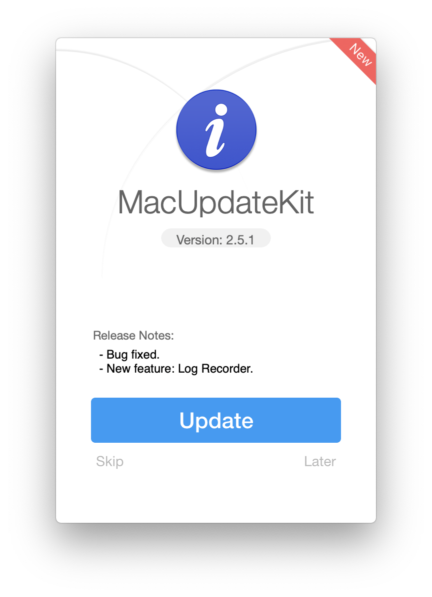

# MacUpdateKit 👾

[](https://github.com/HsiangHo/MacUpdateKit)
[](https://github.com/HsiangHo/MacUpdateKit)
[](https://github.com/HsiangHo/MacUpdateKit/tree/master/MacUpdateServer)
[](https://github.com/HsiangHo/MacUpdateKit/tree/master/MacUpdateServer)

MacUpdateKit is an lightweight software update framework for cocoa developers.


  
## Features

- [x] Customization and Configuration as your needs (for localization).
- [x] Forced upates can be pushed from the backend.
- [x] Show the updates logs.
- [x] Easy to check updates (Async & Sync).
- [x] Awesome UI to request users to update to the new version or skip the current new version.
- [x] Simple and easy PHP backend.
  
## Example

To run the example project, clone the repo and complete the following steps.

1. configure the php files to specify the product information(pid, version, releaseNote, download URL, forced update flag) and deploy the php files to your server.
2. configure the "AppDelegate.m" file in MacUpdateKitDemo, specify the same check updates url, pid, etc.
3. build and run the target 'MacUpdateKitDemo'.

## How does it work

The MacUpdateKit will request app info with the specified PID(Product ID) form the check updates URL you've configured and deployed to your web server (in MacUpdateServer folder). If the new version is detected and also not skipped, there will be a prompt to ask users whether update or not. If the forceUpdateFlag's value is YES, the new version of app will be downloaded and updated automatically.

## Let's get started 🕶

### Configure your server PHP files

- appInfoObject.php

```
//Add your product ID
define("test-product-id",100);
```

- check-for-updates.php

```
//Add your product info
$test_info = new appInfoObject(constant("test-product-id"), "1.1" ,"bug fixed.\nnew feature.", "https://xxxxx.com/download/test.pkg", 0);

//Add switch cases
case constant("test-product-id"):
        $test_info->echoAppInfoJson();
        break;
```

### Configure your cocoa application

- Basic configuration
  
```
MacUpdateAppInfoObject *appObj = [[MacUpdateAppInfoObject alloc] initWithAppName:@"TEST" withAppIcon:[NSImage imageNamed:@"NSComputer"] withCurrentVersion:@"1.0" withProductID:@"100"];
    MacUpdateUIConfiguration *UIConfigure = [[MacUpdateUIConfiguration alloc] init];
    [UIConfigure setSkipButtonTitle:@"Skip"];
    [UIConfigure setUpdateButtonTitle:@"Update"];
    [UIConfigure setLaterButtonTitle:@"Later"];
    [UIConfigure setVersionText:@"Version %@"];
    [UIConfigure setReleaseNotesText:@"Release Notes:"];
    [[MacUpdateManager sharedManager] customize:UIConfigure withCheck4UpdatesURL:@"https://xxxxx.com/php/update/check-for-updates.php"];
```

- Check updates, download and install (Sync & Async)

```
//Sync
BOOL bRslt = [[MacUpdateManager sharedManager] checkAppUpdate:appObj];

//Async
[[MacUpdateManager sharedManager] checkAppUpdateAsync:appObj withCompletionBlock:^(BOOL rslt, MacUpdateAppInfoObject * _Nonnull AppObj) {
        if (rslt && [appObj isNewVersionAvailable] && ![[MacUpdateManager sharedManager] isCurrentNewVersionSkipped:appObj]) {
            if([appObj forceUpdateFlag]){
                // force install updates
                dispatch_async(dispatch_get_main_queue(), ^{
                    [[MacUpdateManager sharedManager] downloadUpdatesInBackground:appObj withCachePath:@"/tmp" withDownloadCompleteBlock:^(BOOL rslt, NSString * _Nonnull installerPath, MacUpdateAppInfoObject * _Nonnull AppObj) {
                        if (rslt) {
                            [[MacUpdateManager sharedManager] installUpdatesInBackground:installerPath];
                        }
                    }];
                });
            }else{
                //prompt alert window
                dispatch_after(dispatch_time(DISPATCH_TIME_NOW, (int64_t)(1 * NSEC_PER_SEC)), dispatch_get_main_queue(), ^{
                    [[MacUpdateManager sharedManager] requestAppUpdateWindow:appObj withCompletionCallback:^(AppUpdateWindowResult rslt, MacUpdateAppInfoObject * _Nonnull AppObj) {
                        switch (rslt) {
                            case AppUpdateWindowResultUpdate:
                                [[NSWorkspace sharedWorkspace] openURL:[NSURL URLWithString: [appObj downloadURL]]];
                                break;
                                
                            case AppUpdateWindowResultSkip:
                                [[MacUpdateManager sharedManager] skipCurrentNewVersion:AppObj];
                                break;
                                
                            case AppUpdateWindowResultLater:
                                break;
                                
                            default:
                                break;
                        }
                    }];
                });
            }
        }
    }];
```


## Requirements

- Runtime: OS X 10.8+
- HTTPS server for serving updates (see [App Transport Security](http://sparkle-project.org/documentation/app-transport-security/))
- PHP web server

## Usage

- Clone the rep, build the MacUpdateKit or copy all the source files into your project.
- Configure the php files to specify the product information(pid, version, releaseNote, download URL, forced update flag) and deploy the php files to your server.
- Configure your client code: specify the same pid, check for updates URL, etc.
